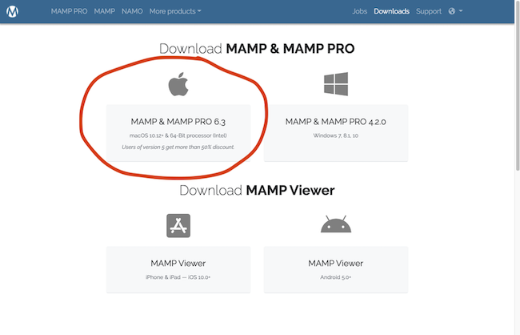
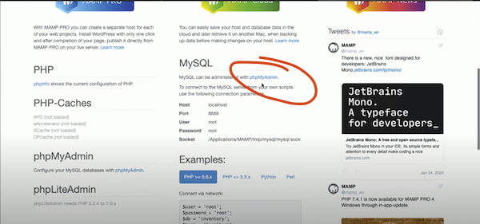

# WordPress Loacl Dvelopment Environment Setup

## MAMP with Apache PHP server

##### Use this guide if you are looking to set up a development environment to build and test WordPress sites locally before connecting to a web host and going live. This will allow you to work on existing wordpress sites or build a completely new site without breaking an existing site, weather you are doing this for your own site or building sites for clients this may be a good alternative to setting up yours or your clients new domain and publishing live. Once you are happy with your new build it is a simple as installing WordPress with your Web Hosting and selecting the new template from your WordPress account. The setup I have done was on a MacOS

## \* First download and install MAMP [here:](https://www.mamp.info/en/downloads/)

## \* Open the install file and run the installation, when prompted install the software in your Applications directory. Once you have successfully installed it you can delete the installer file.

## \* Next download and install WordPress [here:](https://en-au.wordpress.org/download/) from wordpress.org

## \* Open your applications folder, go to the MAMP folder and this is the file structure you need. You must create a new folder in the htdocs folder to hold wordpress site files. Once you download WordPress open the Wordpress folder and move all of its contents into your new folder you just created in the htdocs folder

## \* Next open the MAMP App and click start in the top right this will start your server in your browser at localhost:8888/MAMP/?language=English.

## \* Edit the tab path so it says localhost:8888/

## \* If you see a page like this with your own folder name then you have successfully started the server.

## \* You can now click on the folder in the browser page and it will take you to the WordPress setup

## \* Once you get to this page you need to stop and first setup the database

## \* Next go to your MAMP app and click on Open WebStartpage

## \* This page will open in your browser then scroll down to the MySQL section and click the link to phpMyAdmin

## \* This page will open make sure the databases Tab is selected and on the left click new to create a new database, then give the database a name eg. for my client i used (davidpolson_db) as the DB name. after that click the create button on the right

## \* Next come back to this the WordPress setup tab and click Let's go!

## \* Next enter the DB name and for username and password fields just type root then hit submit. on the next page just click run the installation

## \* This next step will be more important to think about and keep a record of usernames and passwords as this may be for your client

## \* Next you will be able to login to your WordPress dashboard and get started with your site build. It is worth noting that you should go back o MAMP and click stop in the top right corner (you will always need to do this to shut down the server) and restart your computer and restart the server for all configuration to take effect. I was unable to download any plugins on WordPress untill I had done this step
